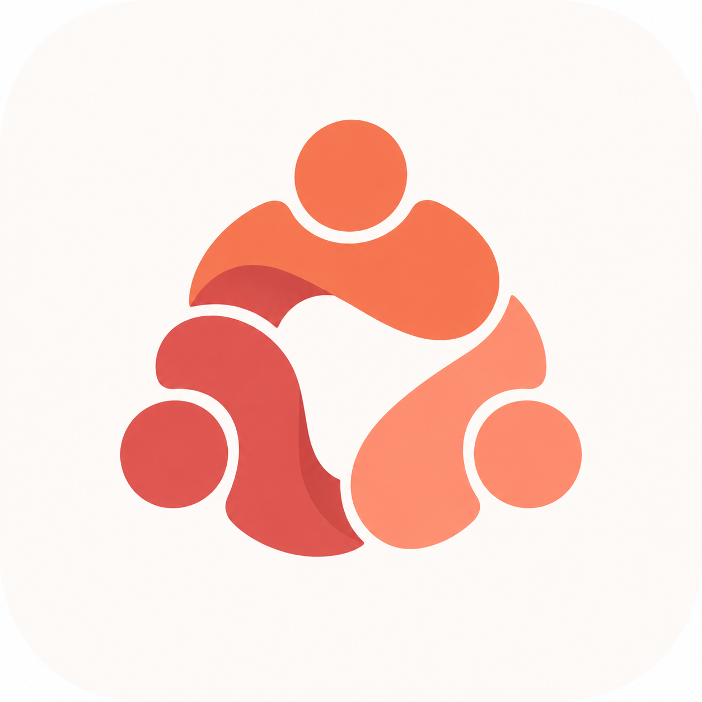

# TEAMYRA

<p align="center">
  
</p>

<p align="center"><strong>Local-first multi-agent coding control plane for Claude Code, Codex, Antigravity, ChatGPT and MCP-compatible developer tools.</strong></p>

<p align="center">
  <a href="https://github.com/itsksrathore/TEAMYRA/actions/workflows/desktop-check.yml"></a>
  <a href="LICENSE"></a>
  
  
</p>

TEAMYRA is an open-source Windows desktop application and local orchestration layer for running multiple AI coding agents from one workspace. It connects provider-native coding agents, routes work between accounts, coordinates parallel jobs, keeps task history locally, and exposes a reusable Model Context Protocol (MCP) endpoint for external coding clients.

## Why TEAMYRA

Most AI coding tools run as isolated assistants. TEAMYRA turns them into a coordinated local workforce.

- **One work desk for multiple coding agents** — Claude Code, Codex, Antigravity and embedded normal ChatGPT.
- **Connect from other coding apps through MCP** — any MCP-compatible client can connect to TEAMYRA's localhost HTTP endpoint.
- **One-click TEAMYRA connection** for supported Claude Code, Codex and Antigravity installations.
- **Parallel task execution** with isolated Git worktrees.
- **Automatic routing and failover** when a worker is unavailable or rate-limited.
- **Multiple provider accounts where profile isolation is verified.**
- **Embedded normal ChatGPT** inside the desktop app without using the OpenAI API.
- **Workspace-scoped tools** for files, search, terminal and Git with destructive-action safeguards.
- **Task graphs, reviews, approvals and handoffs** for larger engineering workflows.
- **Local-first runtime** — jobs, logs, worktrees, profiles and project state stay on your machine.
- **Idle-aware background runtime** — the heavy core sleeps when unused and wakes on the next MCP request.

## Supported agents and clients

| Integration | TEAMYRA support |
| --- | --- |
| Claude Code | Native worker, managed profiles, one-click MCP connection |
| OpenAI Codex CLI | Native worker, managed profiles, one-click MCP connection |
| Antigravity / `agy` | Native worker, one-click MCP connection |
| ChatGPT | Embedded normal web session, local workspace bridge, no OpenAI API |
| Other MCP-compatible coding tools | Connect manually to TEAMYRA's local HTTP MCP endpoint |

Public MCP endpoint:

```text
http://127.0.0.1:8787/mcp
```

TEAMYRA also provides a local stdio MCP mode for clients that prefer stdio transport.

## Desktop workflow

The desktop intentionally has only two primary views:

**Tasks** shows active and completed work, live transcript tails, workspaces, agent identity and Stop controls.

**Agents** shows installed providers, connected accounts, account readiness and provider connection actions. Advanced orchestration, worktrees, observability, memory, recovery and review systems stay behind the simple frontend rather than cluttering the main navigation.

## Core capabilities

### Multi-agent orchestration
- provider-aware worker registry
- automatic worker selection
- account-aware routing
- detached and resumable jobs
- rate-limit cooldown and fallback
- task graphs with dependencies
- approval gates
- independent review/fix loops
- persistent handoffs and recovery

### Git and workspace safety
- isolated Git worktrees for parallel tasks
- diff, rebase, merge and conflict-resolution backend
- workspace path sandboxing
- atomic writes and recovery backups
- recoverable deletes
- confirmation-gated destructive operations
- normalized Git commands
- local audit log

### ChatGPT desktop worker
TEAMYRA can host a normal ChatGPT web session directly inside the Electron desktop application. It uses a persistent embedded Chromium session and a controlled workspace bridge instead of the OpenAI API.

The bridge can expose:
- file list/stat/read/search
- create/write/patch/move/rename/delete
- terminal commands when explicitly enabled
- Git status/diff/log/add/commit/restore
- workspace change inspection

See [docs/CHATGPT_WEB_AGENT.md](docs/CHATGPT_WEB_AGENT.md).

### MCP integration
TEAMYRA exposes canonical `teamyra.*` MCP tools over localhost HTTP and stdio. Claude Code, Codex and Antigravity have dedicated setup flows, while other MCP-capable clients can connect to the same endpoint using their own MCP configuration.

See [docs/INTEGRATIONS.md](docs/INTEGRATIONS.md).

### Low-idle runtime
The lightweight wake gateway stays available on localhost while the heavy MCP core starts only when a real request arrives. The core and hidden desktop can automatically exit after an idle window when there are no active jobs.

Default endpoint and ports:
- public wake gateway: `127.0.0.1:8787/mcp`
- internal core: `127.0.0.1:8788/mcp`
- default idle timeout: 10 minutes

## Install from source

### Requirements
- Windows 10/11 for the desktop build
- Node.js 22+
- Python 3.12+ for development
- Git
- one or more supported provider CLIs if you want native workers

### Setup

```powershell
git clone https://github.com/itsksrathore/TEAMYRA.git
cd TEAMYRA
npm ci
npm run desktop
```

Run the local checks:

```powershell
python -m unittest discover -s tests -p "test_*.py"
npm run desktop:check
npm --workspace @teamyra/desktop run build:renderer
```

Useful commands:

```powershell
npm run teamyra -- doctor
npm run mcp:stdio
npm run mcp:http -- --port 8787
npm run core:build
npm run desktop:dist:win
```

## Windows builds

The packaged desktop includes `teamyra-core.exe`, so end users do not need to install Python separately.

Release artifacts include:
- `TEAMYRA.exe` in the unpacked Windows application
- `TEAMYRA-Setup-<version>-<arch>.exe` NSIS installer
- update metadata for electron-updater

Stable tagged releases are expected to be Authenticode signed. See [docs/WINDOWS_DISTRIBUTION.md](docs/WINDOWS_DISTRIBUTION.md) and [docs/RELEASE_CHECKLIST.md](docs/RELEASE_CHECKLIST.md).

## Security model

TEAMYRA reuses provider-native authentication. It does not intentionally copy provider credentials into project metadata. Runtime profiles, browser sessions, logs, jobs, project memory and user workspaces are excluded from source control.

Destructive filesystem and Git actions are confirmation-gated where appropriate. Unsupported authentication, quota, context-window or account-isolation capabilities are reported as unavailable rather than guessed.

See [SECURITY.md](SECURITY.md).

## Project structure

```text
apps/desktop/        Electron desktop application
bridge/              orchestration core, MCP server and worker runtime
plugins/teamyra/     local coding-agent plugin assets
docs/                architecture and integration documentation
scripts/             build/release helpers
tests/               Python regression and contract tests
```

## Open source

TEAMYRA is released under the [MIT License](LICENSE).

Contributions are welcome. Read [CONTRIBUTING.md](CONTRIBUTING.md), [CODE_OF_CONDUCT.md](CODE_OF_CONDUCT.md) and [SECURITY.md](SECURITY.md) before contributing.

Third-party notices required by retained third-party components are documented in [THIRD_PARTY_NOTICES.md](THIRD_PARTY_NOTICES.md).

## Search terms

TEAMYRA is built for developers looking for a **multi-agent coding orchestrator**, **Claude Code + Codex integration**, **Antigravity MCP integration**, **AI coding agent manager**, **local MCP server**, **parallel AI coding agents**, **AI developer control plane**, **Git worktree AI automation**, **ChatGPT coding desktop**, or a **provider-agnostic AI coding workflow**.
